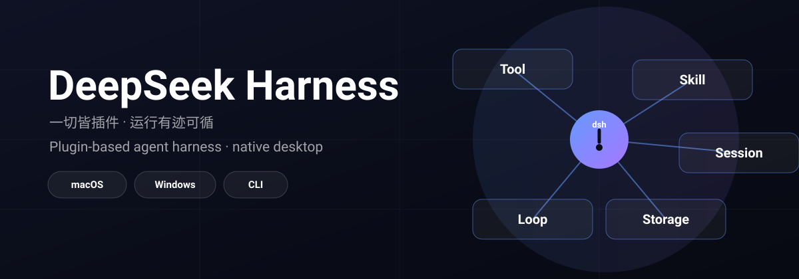
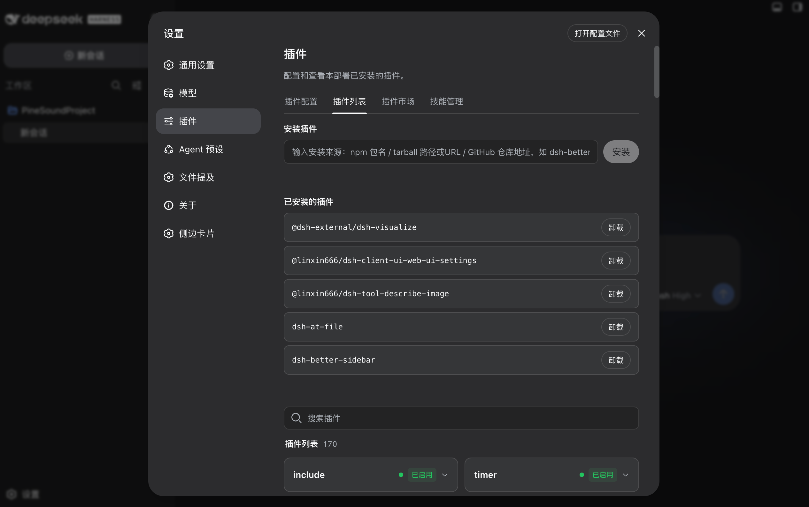
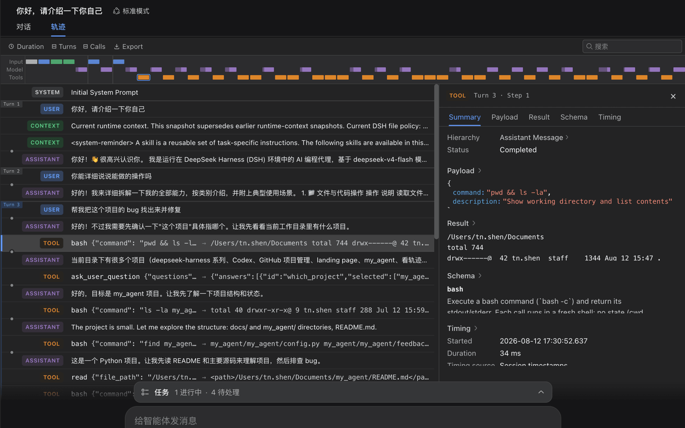
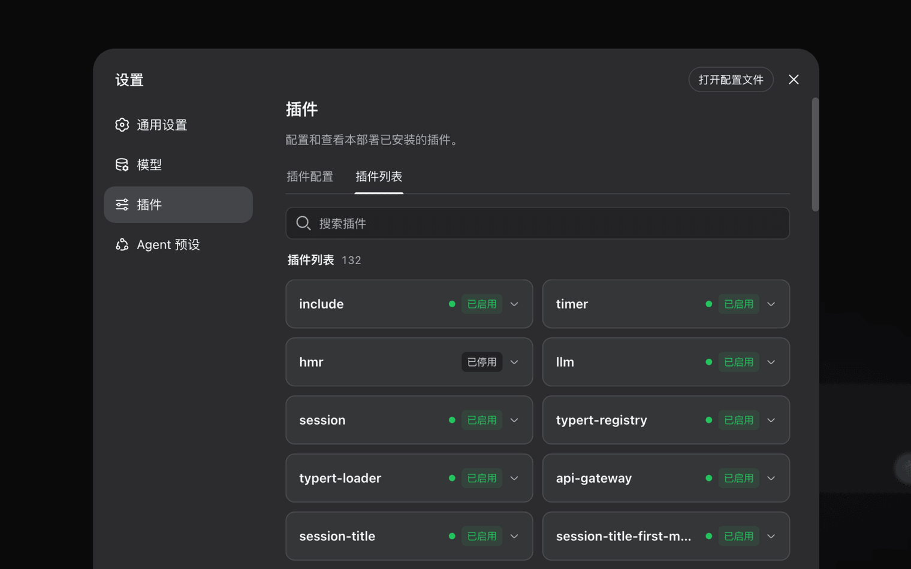
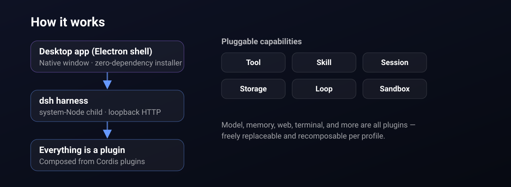

# DeepSeek Harness

<p align="center">
  
</p>

**DeepSeek Harness(`dsh`)** 是一个**一切皆插件**的智能体框架——模型、工具、技能、会话、存储、agent loop,乃至 UI,都是可替换、可按 profile 自由重组的 [Cordis](https://github.com/cordiverse/cordis) 插件。它同时提供 CLI/Web 形态与**原生桌面应用**(`deepseek-harness-desktop`)。

> **社区衍生版**:本仓库是 [deepseek-ai/deepseek-harness](https://github.com/deepseek-ai/deepseek-harness)
> 的社区衍生版,由 PineSound 维护,在**核心 harness 完全不变**的基础上新增了桌面应用、插件市场、
> 图像识别与发布渠道。**本仓库并非 DeepSeek 官方仓库**。完整改动见
> [MODIFICATIONS.md](MODIFICATIONS.md) · [MODIFICATIONS.zh.md](MODIFICATIONS.zh.md)。

---

## 实机效果

<p align="center">
  
  
  
</p>

---

## 它是什么

由插件组装而成的 agent harness。能力都挂在**明确的接缝**之后——**Service Definition / Provider / Consumer**——
因此无需改动 loop 即可替换工具、技能、存储、终端、网页或沙箱。运行**有迹可循**:模型所见的一切都能从会话日志还原。

## 为什么不同

- **一切皆插件**——模型、工具、技能、会话、存储、loop 与 UI 都是可替换、可重组的单元。
- **默认可追溯**——模型可见输入能从会话日志还原,而非黑盒。
- **原生桌面端**——不只是浏览器标签页;macOS 与 Windows 零依赖安装包。
- **开放可扩展**——每个能力都有文档化的接缝,插件生态持续增长。

## 功能

### 桌面应用(原生)
- **双击即用**——无需浏览器标签页或输入 URL。Electron 外壳在回环端口启动真正的 `dsh` 并打开原生窗口。
- **零外部依赖**——安装包内置完整 harness 运行时、vendored pnpm 与平台 Node。
- **跨平台**——macOS(`.dmg`)与 Windows(`.nsis`)安装包,中文菜单与品牌图标。
- **更新机制**——「关于」页读取线上 `releases.json` 检查更新;桌面与发布站共享同一份清单。

### 插件市场
- 可视化插件列表,支持搜索、状态查看与启用/停用;核心系统插件有守卫、不可误关。
- 经内置 pnpm 从 npm / tarball / GitHub 安装,多镜像回退、**免重启**实时生效。

### 图像识别
- 通过 OpenAI 兼容视觉提供方(如阿里云 DashScope)为纯文本模型补齐视觉能力;视觉的密钥 / 接口 / 模型与对话主模型完全独立。

### 技能管理
- 在设置页管理本机技能:列表、安装、卸载、启用/停用、编辑描述。

---

## 工作原理

<p align="center">
  
</p>

桌面只是一个**薄启动器**:它把真正的 `dsh`(`web` 配置)作为独立的系统 Node 子进程启动,解析就绪 URL 并打开窗口。原生插件保持系统 Node ABI,从未加载进 Electron。

---

## 开始使用

### 1. 桌面端(推荐)

到**发布站** <https://deepseek.pinesound.cn/> 下载对应平台的安装包,无需安装步骤;未签名的构建首次打开可能需要右键 → 打开。

### 2. CLI / Web(npm)

安装 Node.js 后运行:

```sh
npx @deepseek-ai/dsh web
```

Web UI 默认运行在 `http://127.0.0.1:3080`。

### 3. 从源码运行

```sh
git clone https://github.com/PineKings/deepseek-harness.git
cd deepseek-harness
pnpm install
pnpm run build
pnpm dsh web
```

### 桌面端开发

```sh
pnpm install
pnpm run build          # 构建 lib + web 前端 dist
pnpm desktop:dev        # 打开桌面窗口
```

### 打包发布

```sh
pnpm --filter @deepseek-ai/dsh-desktop run build:harness   # 组装自包含运行时
pnpm desktop:pack                                          # electron-builder:.dmg / .nsis
pnpm --filter @deepseek-ai/dsh-desktop run stage-release   # 将安装包 + 清单拷入发布站
```

### 质量检查

```sh
pnpm run typecheck
pnpm run lint
pnpm run test
pnpm run test:coverage
pnpm run test:snapshot     # 无密钥回放已组装的应用转写
```

---

## 仓库结构

```
apps/        cli、web、desktop(Electron 外壳)
packages/    @deepseek-ai/dsh-<pkg> 插件工作区
vendor/      内嵌的 Cordis 源码
docs/        架构、用户指南、cookbook
assets/      README 视觉资源
```

---

## 社区与支持

- **发布站**: <https://deepseek.pinesound.cn/>
- **桌面仓库**: <https://github.com/PineKings/deepseek-harness-desktop>
- **上游**: <https://github.com/deepseek-ai/deepseek-harness>
- 插件请打上 [`dsh-plugin`](https://github.com/topics/dsh-plugin) 主题以便被发现。

---

## 开源协议

[MIT](LICENSE)。本项目是 `deepseek-harness`(MIT)的衍生作品,保留原项目版权。第三方依赖及其协议见
[THIRD_PARTY_NOTICES.md](THIRD_PARTY_NOTICES.md)。
